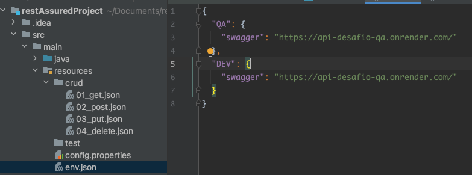
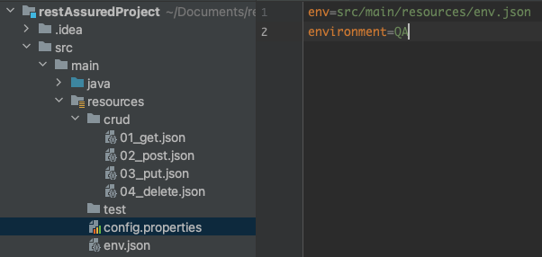
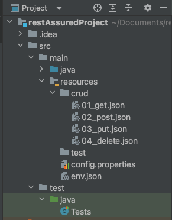

# Request Java + Rest Assured for JSONs

### Configs
> env.json
 

> file properties



### Example use:

#### Create your JSONs in:
> src/main/resources




### Summary: 


This framework is based on Java with RestAssured, on the idea of using only JSONs to make requests.
Here are the steps for a JSON crud:


`get`: will be used to determine which method you will be using. And it can contain a string related to the `env.json` file or just the url.
Whenever there is a slash in the url as in the example below, Java will split it and look for whether both exist in the env.json


`status`: will perform a validation on the status after running the test.


`expect`: will perform validations in your request return.

Ex:

<h4 style="color: #00FFFF">"expect": "name"</h4>
will check if the name exists somewhere in your response

<h4 style="color: #00FFFF">"expect": "id:::id"</h4>

will save the id or ids in a global variable named id. this can be used in the next request

<h4 style="color: #00FFFF">"expect": "age === 30"</h4>

This way I can compare values

<h4 style="color: #00FFFF">"expect": "name === John ::: userName"</h4>

It will validate if the name is equal to Jhon and then save it in a global variable as userName

<h4 style="color: #00FFFF">"expect": "users === John ::: userName > 1"</h4>

will validate the name of the first position and save it with the name userName

<h4 style="color: #00FFFF">"expect": "users ::: userName > 2"</h4>

will save the user from the second position in a global variable named userName

<h4 style="color: #00FFFF">"expect": "address ::: userAddress"</h4>

will save address whit userAddress
``````json
{
  "get": "swagger/users",
  "status": 200,
  "expect": "name"
}
``````
 
### How to use values usaved in expect

Regardless of which value is saved and where it is used, just need to use {string}

```````json
{
  "delete": "swagger/users/{id}",
  "expect": "message"
}
```````
